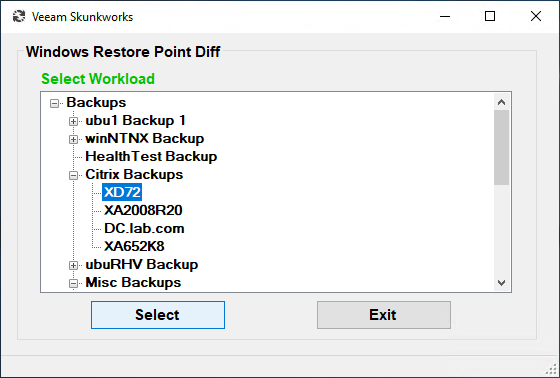
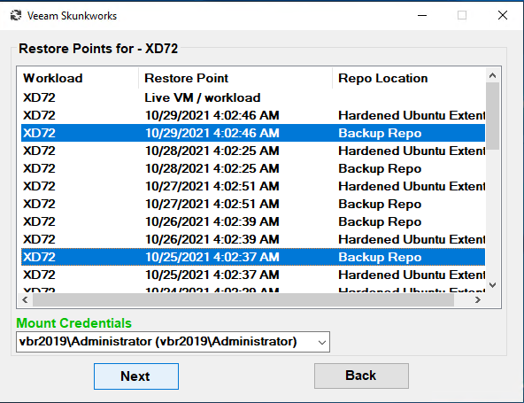
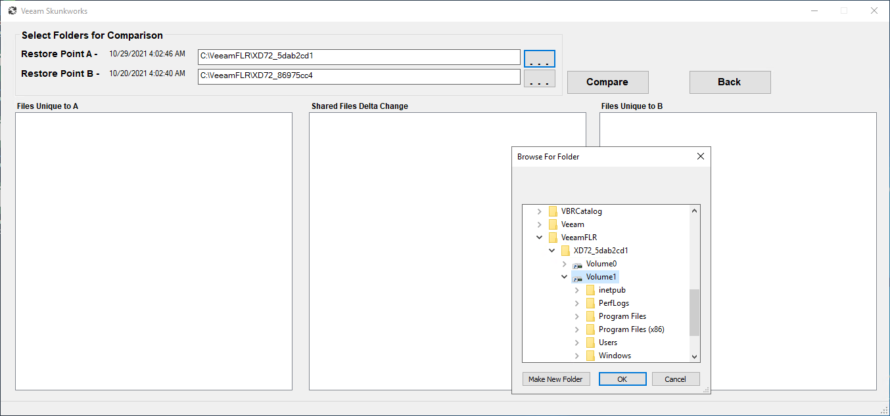
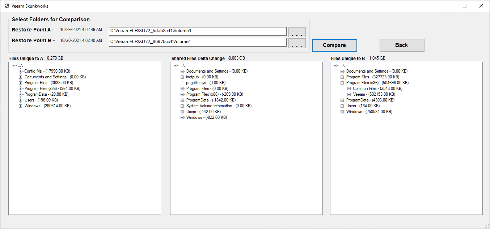
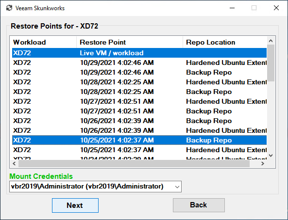
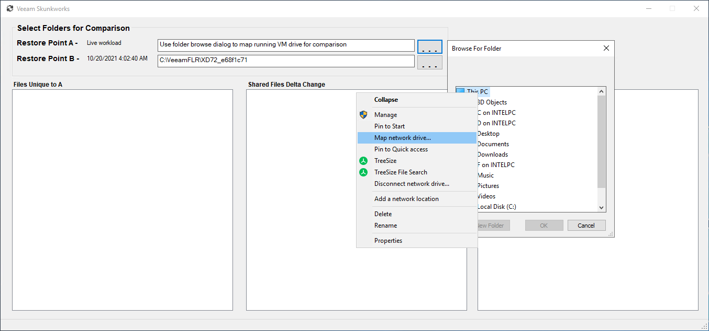
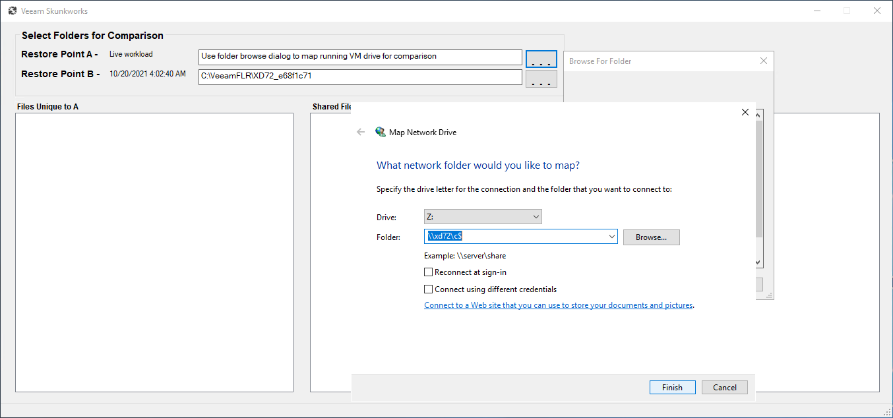
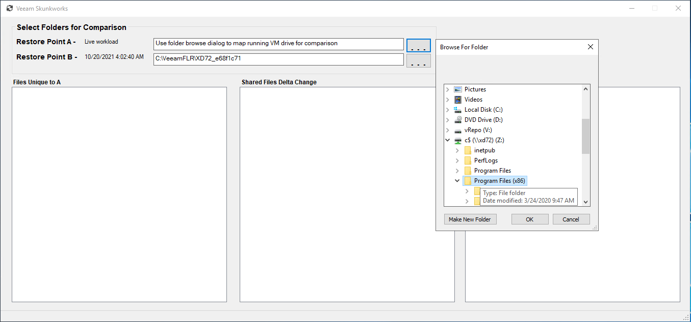
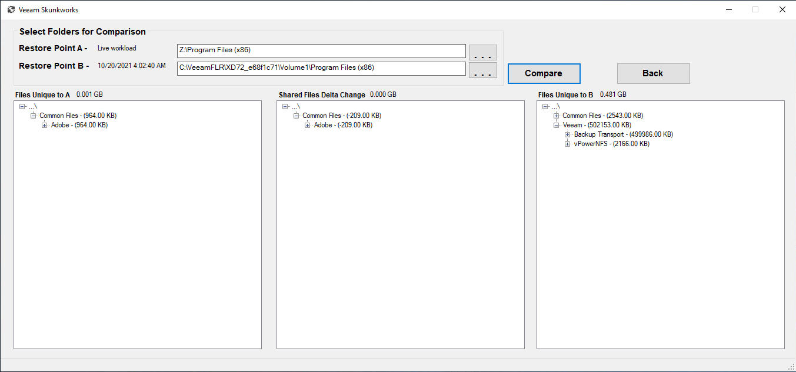

# Veeam Restore Point File-level Comparison Utility

**This repository contains the .MSI installer and source code for this utility.**

This Windows utility leverages the Powershell-based Veeam Data Integration API to mount backup points for the purpose of performing file-level comparison between two backup increments useful for helping determine the source filesystem changes that have caused some sort of restore point size anomoly for instance a daily increment point size substantially larger or smaller than normal.  The utility also accomodates comparing a restore point to a running workload (VM or physical). 

Version 2.0.3 updated for VBR v12+ support

## 📗 Documentation

**Author:** Ronn Martin (ronn.martin@veeam.com)

**System Requirements:** Veeam Backup & Replication (v11+), Veeam Powershell module (v11+), .NET Framework 4.7.2

**Operation:** Only Windows workload backups are currently supported. The utility runs with full Windows backup operator privilege which requires elevated execution permission. If "Compare" is selected directly following the completion of the mount operations, all disks in the backup are compared. It is highly reccommended that only one disk volume or folder set w/in a volume are compared at a time both for performance reasons and due to the fact that workloads with several disks may not always mount in the same order. The application can consume considerable RAM resources and take several minutes to run comparisons of entire backup images e.g. for a Windows 10 backup which includes MySQL, Python, Visual Studio, IIS, etc. a full comparison can take up to 10 minutes and consume 3GB+ RAM. File level differences are flagged and displayed if any of the following conditions are met -

* If a file exists in only one of the restore points
* If the file size has changed between restore points
* If the file modification date has changed between restore points
* If the file's encryption status has changed between restore points.

**Usage:** After installing to a Windows instance that meets the requirements above (most likely the VBR server itself), the application will reside in "\Program Files\Veeam Skunkworks\Veeam Restore Point File Diff\VeeamRestorePointDiff.exe". A start menu shortcut is also added for convenience.
For normal operation, launch the application as administrator and select the Windows workload for comparison from the list of backups and affiliated workloads.

Next choose two restore points to compare from the list of available restore points as well as mount server credentials.  

Selecting "Next" mounts the backup points (\VeeamFLR\...) and presents the dialog for running comparisons. As noted above if all disks should be compared simply select "Compare" otherwise select the file browse dialog "..." buttons to choose the appropriate sub-folders of the mounted backups for comparison.

Once comparisons have completed, any files unique to point "A" or point "B" will be displayed in the left and right columns respectively.  Any files that have changed will show in the center column. Note that the sizes displayed for the changed files will be file "A" size - file "B" size. There may also be a number of files/folders which show size 0. These may be accounted for if only the encryption status has changed or if the files are symbolically linked and the "real" file changed. Otherwise the respective file sizes are rolled up to the parent folder levels to expedite identification of primary filesystem change source(s).

*Compare to live* - If the static **"<< workload name >> Live VM/workload"** option is chosen from the point selection dialog the backup restore point selected will be mounted as noted above. It will then be incumbent on the user to map a drive/folder from the live VM/workload with the file browse dialog to compare with the corresponding mounted backup filesystem. 

Otherwise operation proceeds as normal (example below). This capability may be helpful for identifying files added, deleted or changed on the live server instance since a prior backup run for example.

*Remote mount servers* - If the application cannot be installed on the mount server it will still function however with additional manual steps. The remote server volume that mounts the backups will need to be manually mapped within the file browse dialog exposed in the comparison dialog. Once the remote drive is mounted the \VeeamFLR folder can be navigated to select the mounted volumes or folders for comparison.

**Troubleshooting:**
The most likely cause of failure during the process is the selection of invalid mount credentials. Refer to Veeam's Data Integration API documentation for additional details - [Veeam Helpcenter](https://helpcenter.veeam.com/docs/backup/powershell/publish-vbrbackupcontent.html?ver=110)

## ✍ Contributions

We welcome contributions from the community! We encourage you to create [issues](https://github.com/VeeamHub/veeam-restore-point-utility/issues/new/choose) for Bugs & Feature Requests and submit Pull Requests. For more detailed information, refer to our [Contributing Guide](CONTRIBUTING.md).

## 🤝🏾 License

* [MIT License](LICENSE)

## 🤔 Questions

If you have any questions or something is unclear, please don't hesitate to [create an issue](https://github.com/VeeamHub/veeam-restore-point-utility/issues/new/choose) and let us know!
